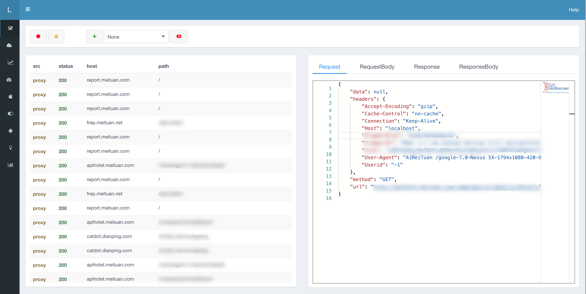

# Lyrebird

[](https://travis-ci.org/meituan/lyrebird)
[](https://pypi.python.org/pypi/lyrebird)


----

# 目录

- [简介](#简介)
- [快速开始](#快速开始)
  - [环境要求](#环境要求)
  - [安装](#安装)
  - [启动](#启动)
  - [连接移动设备](#连接移动设备)
  - [查看及录制数据](#查看及录制数据)
- [基本命令](#基本命令)
- [在代码中使用Lyrebird](#在代码中使用lyrebird)
- [开发者指南](#开发者指南)
  - [配置Lyrebird工程](#配置lyrebird工程)
- [感谢](#感谢)

# 简介

**Lyrebird** 是一个基于拦截以及模拟HTTP/HTTPS网络请求的面向移动应用的插件化测试平台。

**Lyrebird** 不止提供UI操作，也可以通过API控制所有功能。

**Lyrebird** 也可作为服务端接口测试mock工具使用。


> Lyrebird (琴鸟) 不但美丽壮观，且能歌善舞。它不但能模仿各种鸟类的鸣叫声，还能学人间的各种声音。如汽车喇叭声、火车喷气声、斧头伐木声、修路碎石机声及领号人的喊叫声等。歌声婉转动听，舞姿轻盈合拍，是澳洲鸟类中最受人喜爱的珍禽之一。



----


# 快速开始


## 环境要求

* macOS

* Python >= 3.6

```bash
# 推荐使用Homebrew(https://brew.sh/#install)安装Python3
brew install python3
```

## 安装

```bash
# 安装lyrebird
pip3 install lyrebird
```

## 启动

```bash
lyrebird
```

## 连接移动设备

* 启动Lyrebird后，移动设备需要通过代理的方式将请求数据接入。

* 将移动设备的代理地址设为当前电脑地址，默认端口为4272（IP地址可查看Lyrebird启动时输出的日志）

* 被测设备上用浏览器打开 http://mitm.it, 选择对应操作系统安装证书

> 现在，可以开始操作移动设备了。Lyrebird将显示捕获到的HTTP/HTTPS请求。

## 查看及录制数据


* 如上图，准备工作完成后，操作手机即可以看到HTTP/HTTPS请求的数据。

* 上图中按钮栏的按钮依次是：

    1. 录制按钮
    2. 清除inspector数据按钮
    3. 新建mock数据组按钮
    4. 激活mock数据组选择器
    5. 取消激活mock数据按钮

* 操作图中(1)按钮栏的录制按钮，则可开始数据的录制工作。

    > 录制数据要求新建或选中一组mock数据。即操作按钮3或4。

* 激活mock数据选择器，选择mock数据后。经过Lyrebird的请求会被mock，如果mock数据中没有匹配的数据，则会代理该请求。

    > mock数据可由左边导航栏切换到DataManager界面进行编辑管理
----

# 基本命令

* **lyrebird**

    以缺省参数启动lyrebird

* **lyrebird -v**

    以输出详细日志模式启动lyrebird

* **lyrebird -b**

    启动lyrebird不默认打开浏览器

* **lyrebird --mock 9090 --proxy 4272 --data . --config your/config/file**

    指定参数启动lyrebird

    参数：

        --mock 默认9090 ， mock服务及前端端口

        --proxy 默认4272， 代理服务端口

        --data 默认./data, mock数据根目录
        
        --config 默认~/.lyrebird/conf.json, lyrebird启动配置

----

# 在代码中使用Lyrebird

```python
import lyrebird
server = lyrebird.Server()

# 设置服务端口及数据根目录, 不设置可以使用默认值 mock port = 9090, proxy port = 4272, data root dir = ./data
server.mock_port(9090)
server.proxy_port(4272)
server.data_root_dir('./data')  

# 启动服务
server.start()

# 停止服务
server.stop()
```

----

# 开发者指南

## 配置Lyrebird工程

```bash
# clone 代码
git clone https://github.com/meituan/lyrebird.git

# 进入工程目录
cd lyrebird

# 初始化开发环境
sh dev.sh

# 使用IDE打开工程（推荐Pycharm或vscode）

# 在IDE中执行debug.py即可开始调试
```

----

# 感谢

本工具中的代理功能使用[mitmproxy](https://github.com/mitmproxy/mitmproxy)实现。
