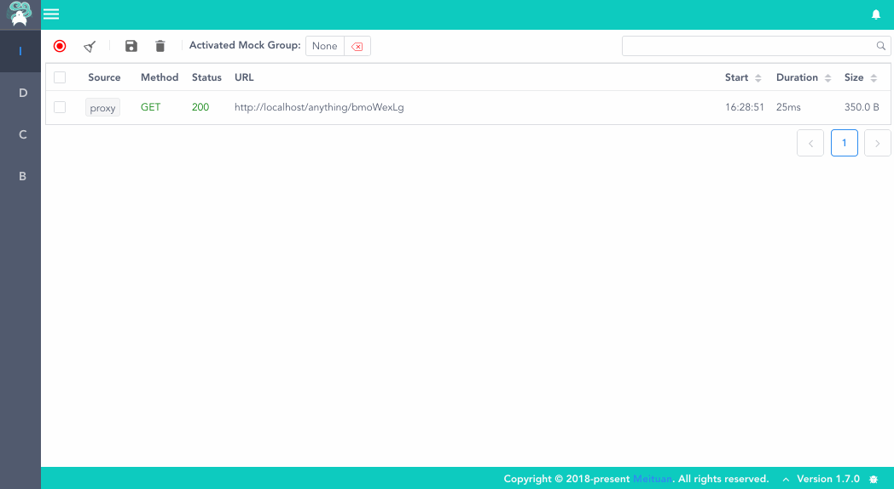
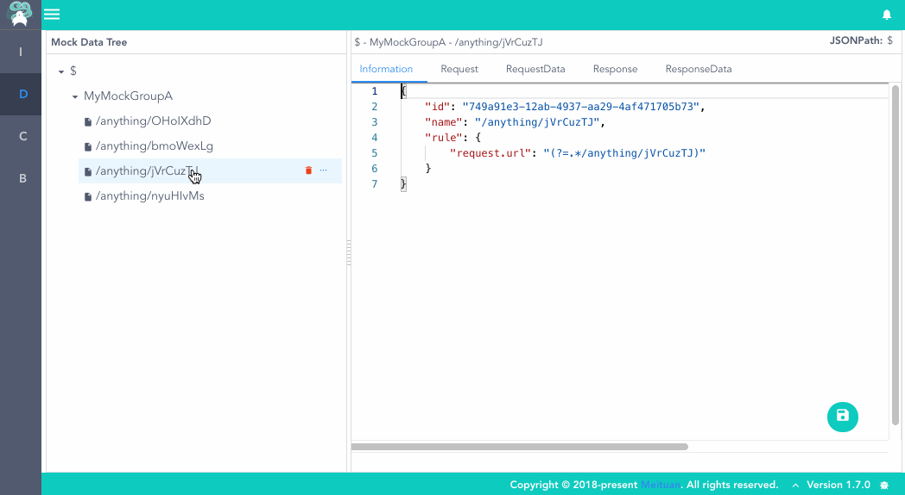

> 🔔 **We are hiring. 欢迎加入：**[工具链建设](https://zhaopin.meituan.com/job-detail?jobId=676386152) | [所有职位](https://zhaopin.meituan.com/job-list?jobFamily=203&jobFamilyGroup=29&keywords=%E5%88%B0%E5%BA%97%E5%B9%B3%E5%8F%B0%E6%8A%80%E6%9C%AF&pageNo=1)

---

<p align="center"><a herf="https://meituan-dianping.github.io/lyrebird/"></a></p>
<h1 align="center">Lyrebird</h1>


[](https://lgtm.com/projects/g/Meituan-Dianping/lyrebird/context:python)
[](https://lgtm.com/projects/g/Meituan-Dianping/lyrebird/context:javascript)

# [PYPI](https://pypi.org/project/lyrebird/)

[](https://pypi.python.org/pypi/lyrebird)


```
pip install lyrebird
```

# [DockerHub](https://hub.docker.com/r/overbridge/lyrebird)


```
docker pull overbridge/lyrebird
```

# [Docs](https://meituan-dianping.github.io/lyrebird)

[](https://meituan-dianping.github.io/lyrebird/)
[](#backers)
[](#sponsors)


---

- [简介](#简介)
- [快速开始](#快速开始)
  - [环境要求](#环境要求)
  - [安装](#安装)
  - [启动](#启动)
  - [连接移动设备](#连接移动设备)
  - [查看及录制数据](#查看及录制数据)
  - [使用 Mock 数据](#使用Mock数据)
  - [Mock 数据管理](#Mock数据管理)
- [基本命令](#基本命令)
- [感谢](#感谢)

# 简介

**Lyrebird** 是一个基于拦截以及模拟 HTTP/HTTPS 网络请求的面向移动应用的插件式测试平台。

**Lyrebird** 不只提供 UI 操作，也可以通过 API 控制所有功能。

**Lyrebird** 也可作为服务端接口测试 mock 工具使用。

**Lyrebird** 可以通过**插件**扩展能力，实现埋点自动测试、API 覆盖率统计、移动设备及 APP 控制和信息记录、自定义检查脚本等一系列功能。

> Lyrebird (琴鸟) 不但美丽壮观，且能歌善舞。它不但能模仿各种鸟类的鸣叫声，还能学人间的各种声音。如汽车喇叭声、火车喷气声、斧头伐木声、修路碎石机声及领号人的喊叫声等。歌声婉转动听，舞姿轻盈合拍，是澳洲鸟类中最受人喜爱的珍禽之一。

---

# 快速开始

## 环境要求

- macOS/Windows

* Python >= 3.6

```bash
# 推荐使用Homebrew(https://brew.sh/#install)安装Python3
brew install python3
```

Windows 需要的额外步骤：

- 下载并安装[编译版 OpenSSL](https://slproweb.com/products/Win32OpenSSL.html)
- 设置系统环境变量（根据实际路径调整）
  - LIB = C:\Program Files\OpenSSL-Win64\lib
  - INCLUDE = C:\Program Files\OpenSSL-Win64\include

## 安装

```bash
# 安装lyrebird
pip3 install lyrebird
```

## 启动

```bash
lyrebird
```

## 连接移动设备

- 启动 Lyrebird 后，移动设备需要通过代理的方式将请求数据接入。

- 将移动设备的代理地址设为当前电脑地址，默认端口为 4272（IP 地址可查看 Lyrebird 启动时输出的日志）

- 被测设备上用浏览器打开 http://mitm.it, 选择对应操作系统安装证书

> Lyrebird 接入有两种方式:

a. 设置代理


b. 直连


## 查看及录制数据

> 现在，可以开始操作移动设备了。Lyrebird 将显示捕获到的 HTTP/HTTPS 请求。
>
> 选中请求后，可以将它保存到已激活的 mock 数据组中。



## 使用 Mock 数据

> 激活 mock 数据选择器，选择 mock 数据后。经过 Lyrebird 的请求会被 mock，如果 mock 数据中没有匹配的数据，则会代理该请求。
>
> 可以在 DataManager 界面管理 mock 数据。



## Mock 数据管理

> mock 数据可由左边导航栏切换到 DataManager 界面进行编辑管理


---

## 插件

---

# 基本命令

- **lyrebird**

  以缺省参数启动 lyrebird

- **lyrebird -v**

  以输出详细日志模式启动 lyrebird

- **lyrebird -b**

  启动 lyrebird 不默认打开浏览器

- **lyrebird --mock 9090 --proxy 4272 --data . --config your/config/file**

  指定参数启动 lyrebird

  参数：

        --mock 默认9090 ， mock服务及前端端口

        --proxy 默认4272， 代理服务端口

        --data 默认./data, mock数据根目录

        --config 默认~/.lyrebird/conf.json, lyrebird启动配置

---

# 感谢

本工具中的代理功能使用[mitmproxy](https://github.com/mitmproxy/mitmproxy)实现。

## Contributors

This project exists thanks to all the people who contribute.
<a href="https://github.com/Meituan-Dianping/lyrebird/graphs/contributors"></a>
