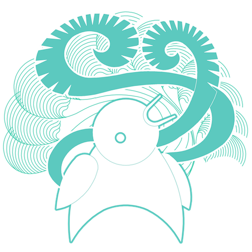
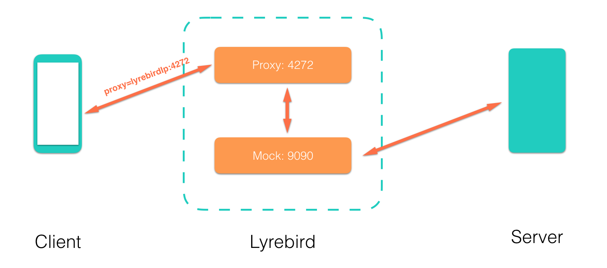
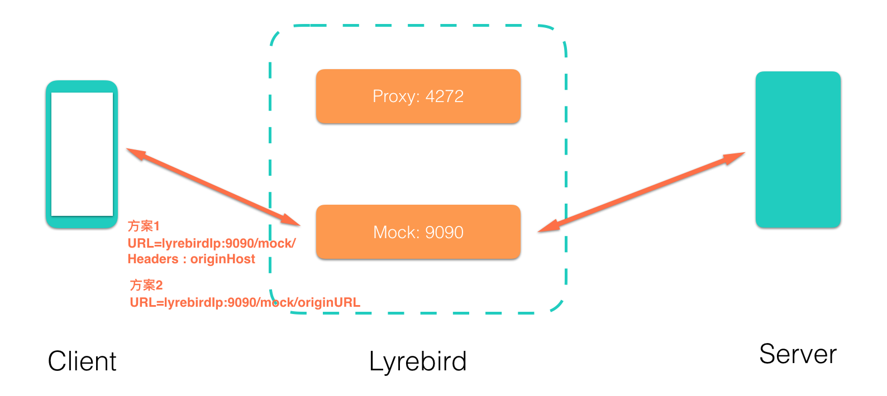
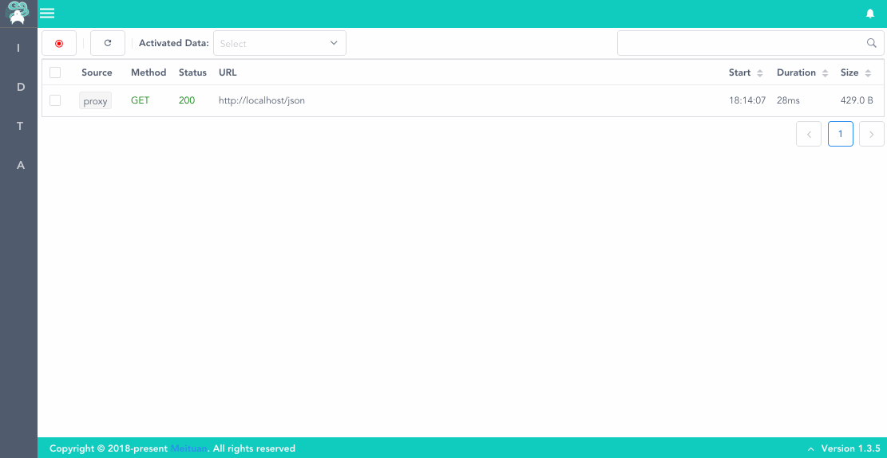
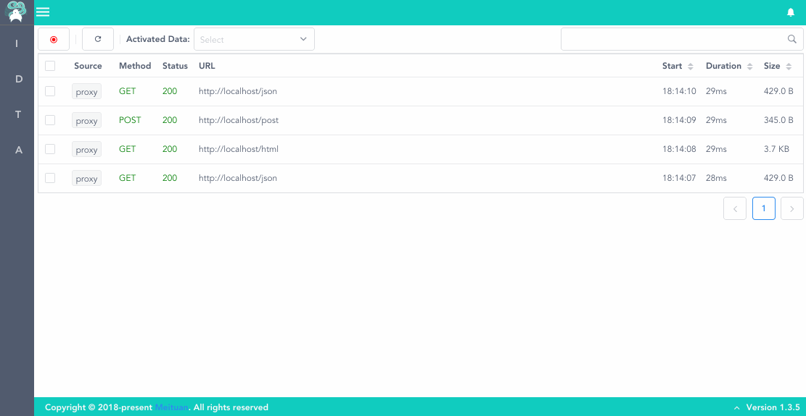
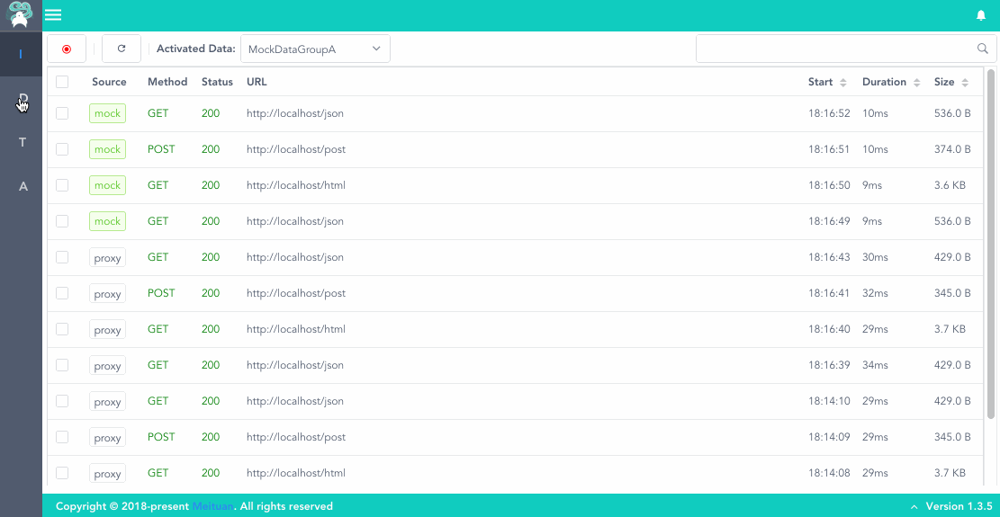

<p align="center"><a herf="https://meituan-dianping.github.io/lyrebird/"></a></p>
<h1 align="center">Lyrebird</h1>

[](https://travis-ci.org/Meituan-Dianping/lyrebird)
[](https://pypi.python.org/pypi/lyrebird)


[](#backers) 
[](#sponsors) 
[](https://meituan-dianping.github.io/lyrebird/)

----

# 目录

- [简介](#简介)
- [快速开始](#快速开始)
  - [环境要求](#环境要求)
  - [安装](#安装)
  - [启动](#启动)
  - [连接移动设备](#连接移动设备)
  - [查看及录制数据](#查看及录制数据)
  - [使用Mock数据](#使用Mock数据)
  - [Mock数据管理](#Mock数据管理)
- [基本命令](#基本命令)
- [开发者指南](#开发者指南)
  - [配置Lyrebird工程](#配置lyrebird工程)
- [感谢](#感谢)

# 简介

**Lyrebird** 是一个基于拦截以及模拟HTTP/HTTPS网络请求的面向移动应用的插件式测试平台。

**Lyrebird** 不只提供UI操作，也可以通过API控制所有功能。

**Lyrebird** 也可作为服务端接口测试mock工具使用。

**Lyrebird** 可以通过**插件**扩展能力，实现埋点自动测试、API覆盖率统计、移动设备及APP控制和信息记录、自定义检查脚本等一系列功能。


> Lyrebird (琴鸟) 不但美丽壮观，且能歌善舞。它不但能模仿各种鸟类的鸣叫声，还能学人间的各种声音。如汽车喇叭声、火车喷气声、斧头伐木声、修路碎石机声及领号人的喊叫声等。歌声婉转动听，舞姿轻盈合拍，是澳洲鸟类中最受人喜爱的珍禽之一。


----


# 快速开始


## 环境要求

* macOS

* Python >= 3.6

```bash
# 推荐使用Homebrew(https://brew.sh/#install)安装Python3
brew install python3
```

## 安装

```bash
# 安装lyrebird
pip3 install lyrebird
```

## 启动

```bash
lyrebird
```

## 连接移动设备

* 启动Lyrebird后，移动设备需要通过代理的方式将请求数据接入。

* 将移动设备的代理地址设为当前电脑地址，默认端口为4272（IP地址可查看Lyrebird启动时输出的日志）

* 被测设备上用浏览器打开 http://mitm.it, 选择对应操作系统安装证书

>Lyrebird接入有两种方式:

a. 设置代理



b. 直连




## 查看及录制数据

> 现在，可以开始操作移动设备了。Lyrebird将显示捕获到的HTTP/HTTPS请求。




## 使用Mock数据



> 激活mock数据选择器，选择mock数据后。经过Lyrebird的请求会被mock，如果mock数据中没有匹配的数据，则会代理该请求。

## Mock数据管理



> mock数据可由左边导航栏切换到DataManager界面进行编辑管理

----

## 插件

----

# 基本命令

* **lyrebird**

    以缺省参数启动lyrebird

* **lyrebird -v**

    以输出详细日志模式启动lyrebird

* **lyrebird -b**

    启动lyrebird不默认打开浏览器

* **lyrebird --mock 9090 --proxy 4272 --data . --config your/config/file**

    指定参数启动lyrebird

    参数：

        --mock 默认9090 ， mock服务及前端端口

        --proxy 默认4272， 代理服务端口

        --data 默认./data, mock数据根目录
        
        --config 默认~/.lyrebird/conf.json, lyrebird启动配置

----

# 开发者指南

## 拉取代码

```bash
# clone 代码
git clone https://github.com/Meituan-Dianping/lyrebird.git
```

## 前端开发

```bash
# clone完成后进入前端工程目录
cd lyrebird/frontend

# 安装依赖
npm install

# 启动调试服务
npm run serve

# 构建
npm run build
```

## 后端开发

```bash
# clone完成后进入工程目录
cd lyrebird

# 初始化开发环境
sh dev.sh

# 打开项目 - 推荐使用vscode进行开发
code .
```

## 在IDE中执行debug.py即可开始调试
> vscode debug 配置
```json
{
    "version": "0.2.0",
    "configurations": [
        {
            "name": "Python: Lyrebird",
            "type": "python",
            "request": "launch",
            "program": "${workspaceFolder}/debug.py",
            "console": "integratedTerminal",
            "args": [
                "-v"
            ]
        },
        {
            "type": "chrome",
            "request": "launch",
            "name": "vuejs: chrome",
            "url": "http://localhost:8080/ui/static/",
            "webRoot": "${workspaceFolder}/frontend/src/",
            "breakOnLoad": true,
            "sourceMapPathOverrides": {
              "webpack:///src/*": "${webRoot}/*"
            }
        }
    ]
}
```

----

# 感谢

本工具中的代理功能使用[mitmproxy](https://github.com/mitmproxy/mitmproxy)实现。

## Contributors

This project exists thanks to all the people who contribute. 
<a href="https://github.com/Meituan-Dianping/lyrebird/graphs/contributors"></a>


## Backers

Thank you to all our backers! 🙏 [[Become a backer](https://opencollective.com/lyrebird#backer)]

<a href="https://opencollective.com/lyrebird#backers" target="_blank"></a>


## Sponsors

Support this project by becoming a sponsor. Your logo will show up here with a link to your website. [[Become a sponsor](https://opencollective.com/lyrebird#sponsor)]

<a href="https://opencollective.com/lyrebird/sponsor/0/website" target="_blank"></a>
<a href="https://opencollective.com/lyrebird/sponsor/1/website" target="_blank"></a>
<a href="https://opencollective.com/lyrebird/sponsor/2/website" target="_blank"></a>
<a href="https://opencollective.com/lyrebird/sponsor/3/website" target="_blank"></a>
<a href="https://opencollective.com/lyrebird/sponsor/4/website" target="_blank"></a>
<a href="https://opencollective.com/lyrebird/sponsor/5/website" target="_blank"></a>
<a href="https://opencollective.com/lyrebird/sponsor/6/website" target="_blank"></a>
<a href="https://opencollective.com/lyrebird/sponsor/7/website" target="_blank"></a>
<a href="https://opencollective.com/lyrebird/sponsor/8/website" target="_blank"></a>
<a href="https://opencollective.com/lyrebird/sponsor/9/website" target="_blank"></a>
