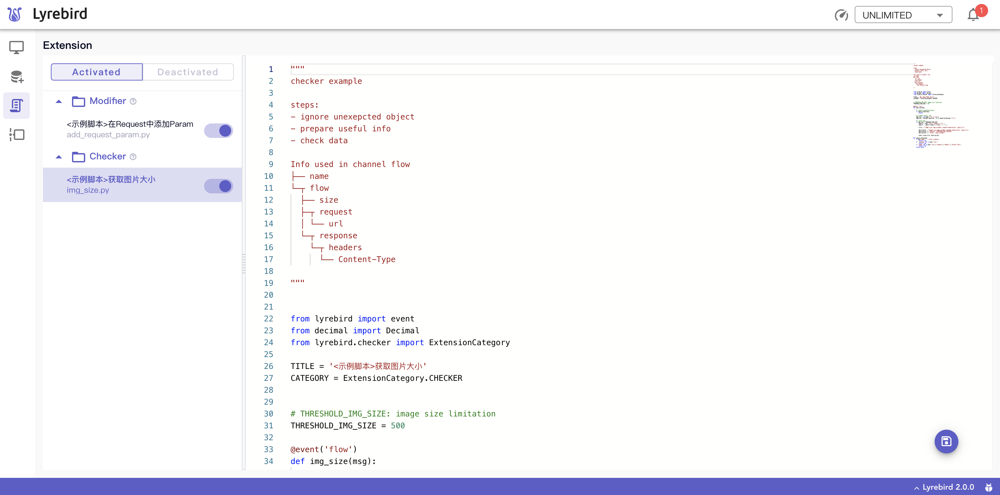

# 使用指南

检查器(Checker)是一种支持用户⾃定义的Python脚本，在Lyrebird运行的过程中，于后台并行地工作。

无需搭建工程和前端开发，检查器可灵活、轻巧、便捷、准确的对[消息总线](/advance/eventbus.md)频道中的数据进行分析和校验。如可通过检查器监听网络请求频道，检测网络请求中的[图片大小](/checker/examples.html#大图检测)是否满足预期，或检测是否[重复请求](/checker/examples.html#重复请求检测)了同一个接口。

可以在Lyrebird运行过程中随时开启或关闭检查器，即插即用，方便灵活。



> 展开Checker标签可查看当前运行的检查器

如果需要高级的检查和展示，可使用[插件](/plugins/)开发实现更复杂的场景和功能。

## 载入检查器

运行时携带的检查器存放在默认路径~/.lyrebird/checkers下。对检查器的新增、修改、删除检查器，可在默认目录下操作文件。

当默认目录中没有可用的检查器时，会自动载入示例脚本。目前提供的示例脚本如下：

| Filename | Description |
| :------- | :---------- |
| [img_size.py](https://github.com/Meituan-Dianping/lyrebird/tree/master/lyrebird/examples/checkers/img_size.py) | 检查网络请求中图片大小是否超出限制 |
| [duplicate_requests.py](https://github.com/Meituan-Dianping/lyrebird/tree/master/lyrebird/examples/checkers/duplicate_requests.py) | 检查在某段时间内是否有重复的网络请求 |

此外，Lyrebird支持使用在启动时指定需要加载的脚本。

```sh
lyrebird --script [filename] --script [filename]
```

## 捕获报警

在获取到数据后，便可对该数据进行检验和处理。当发现异常数据时，Lyrebird会在通知中心展示报警信息。


报警中可携带检查出的异常信息，也可以携带[消息总线](/advance/eventbus.md)中其它频道的消息作为辅助信息，以丰富报警信息。
