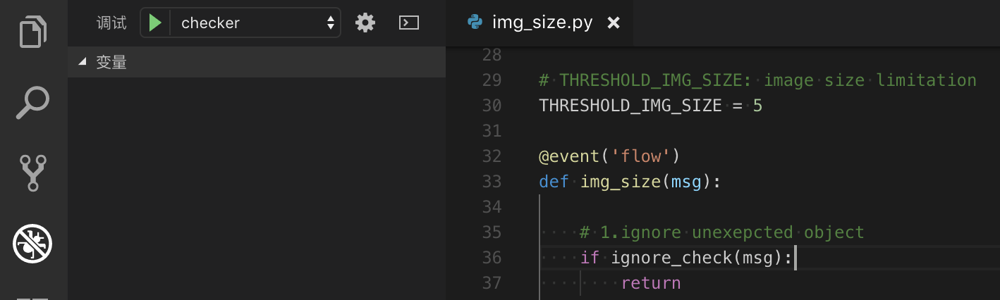

# 第一个检查器

Lyrebird支持灵活的检查器编写、调试和运行。

## 环境准备

在调试脚本的目录下，创建虚拟环境

```sh
python3 -m venv venv
```

激活虚拟环境

```sh
source venv/bin/activate
```

安装lyrebird

```sh
pip3 install lyrebird
```

## 编写检查器

检查器的目的是实时检查Lyrebird中某个频道的数据是否满足预期。

### 监听频道

在消息总线的频道中，flow频道包含了所有的网络请求，监听flow频道以获得设备的网络请求。

```py
from lyrebird import CustomEventReceiver

event = CustomEventReceiver()

@event('flow')
def img_size(msg):
    pass
```

### 数据校验

flow频道中出现新的数据时会回调img_size方法，并传入msg。此时，可对msg中的数据进行检测。

```py
from lyrebird import CustomEventReceiver

event = CustomEventReceiver()

THRESHOLD_IMG_SIZE = 1024

@event('flow')
def img_size(msg):
    if msg.get('size') > THRESHOLD_IMG_SIZE:
        # Do something

    return
```

检查中需要明确的预期值作为阈值，可以通过修改含THRESHOLD字样的变量，来修改检查器中的预期值。

### 报警

当检测到不满足预期的数据时，可调用issue接口触发报警。
```py
from lyrebird import CustomEventReceiver

event = CustomEventReceiver()

THRESHOLD_IMG_SIZE = 1024

@event('flow')
def img_size(msg):
    if msg.get('size') > THRESHOLD_IMG_SIZE:
        event.issue('Image size is beyond expectations!')

    return
```

## 调试

调试推荐使用vscode。

### 调试配置

vscode debug配置如下。

```json
{
    "version": "0.2.0",
    "configurations": [
        {
            "name": "checker",
            "type": "pythonExperimental",
            "request": "launch",
            "program": "${workspaceFolder}/venv/bin/lyrebird",
            "args": [
                "--script",
                "${file}"
            ],
            "console": "integratedTerminal"
        }
    ]
}
```

### 开始调试

在所调试脚本为打开窗口时，在调试窗口选择checker，点击开始按钮即可开始调试。



## 运行检查器

将编写好的检查器移入~/.lyrebird/checkers目录，启动lyrebird，便会自动载入编写好的检查器。
