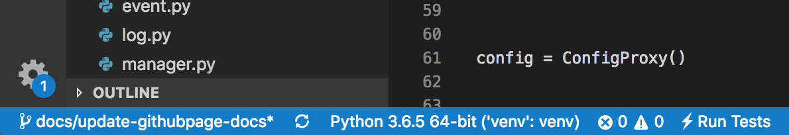

# 开发环境配置

## 开发环境

* macOS OR Linux

* Python3

* NodeJS

* vscode(推荐)

* Chrome(推荐)


## 配置Lyrebird工程

```bash
# clone 代码
git clone https://github.com/Meituan-Dianping/lyrebird.git

# 进入工程目录
cd lyrebird

# 初始化后端开发环境
sh dev.sh

# 初始化前端开发环境
cd frontend
npm install
cd ..

# 使用IDE打开工程（推荐vscode）
code .
```

## 调试代码

Vscode debug 配置
```JSON
{
    "version": "0.2.0",
    "configurations": [
        {
            "name": "Python: Lyrebird",
            "type": "python",
            "request": "launch",
            "program": "${workspaceFolder}/debug.py",
            "console": "integratedTerminal",
            "args": [
                "-v"
            ]
        },
        {
            "type": "chrome",
            "request": "launch",
            "name": "vuejs: chrome",
            "url": "http://localhost:8080/ui/static/",
            "webRoot": "${workspaceFolder}/frontend/src/",
            "breakOnLoad": true,
            "sourceMapPathOverrides": {
              "webpack:///src/*": "${webRoot}/*"
            }
        }
    ]
}
```

### 后端代码

1. 激活python虚拟环境
    
    > 执行过dev.sh后会在项目根目录下创建一个venv目录，这里是一个安装好依赖的python虚拟环境

    > 通过 ```source venv/bin/activate``` 来激活该环境

    > 以Vscode为例，不需要上面的激活操作，我们只需在Vscode下方的python环境选择器中选择对应的环境即可
    

2. 通过Debug功能启动

按照上面 debug配置中 python:Lyrebrid配置启动即可

### 前端代码

1. 启动node server

```bash
# 进入前端目录
cd frontend

# 启动前端node serve
npm run serve
```

2. 通过Debug功能启动浏览器

按照上面 debug配置中 vuejs: chrome 配置启动即可

> 注意: vscode 需要安装chrome debug插件
