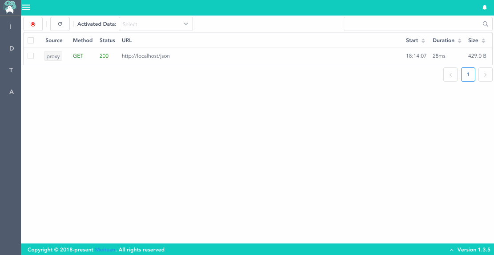
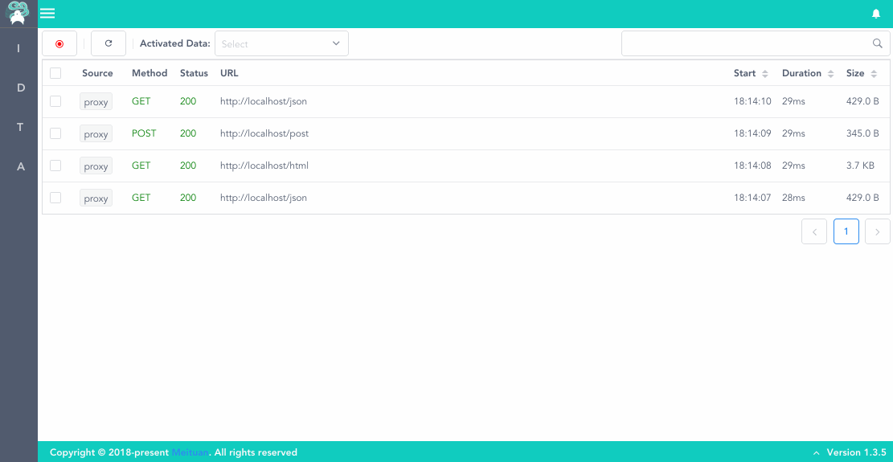
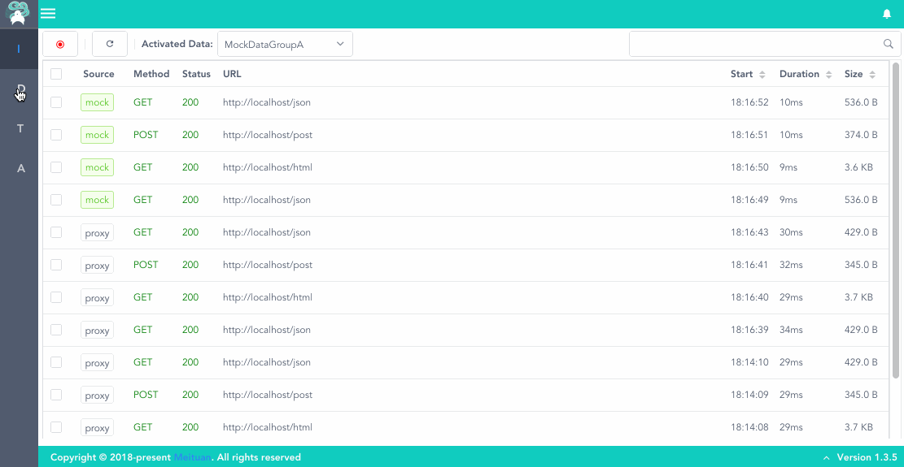

# 快速开始

## 环境要求

* macOS OR Linux

* Python3.6及以上

## 安装

```python        
pip3 install lyrebird
```
        
## 启动

```python
lyrebird
```

## 连接移动设备

* 启动Lyrebird后，移动设备需要通过代理的方式将请求数据接入。                

* 将移动设备的代理地址设为当前电脑地址，默认端口为4272（IP地址可查看Lyrebird启动时输出的日志）

* 被测设备上用浏览器打开 http://mitm.it, 选择对应操作系统安装证书

    * 信任刚才安装的证书。

    * 现在，可以开始操作移动设备了。Lyrebird将显示捕获到的http请求。

## 查看及录制数据



## 使用mock数据



## 管理mock数据


