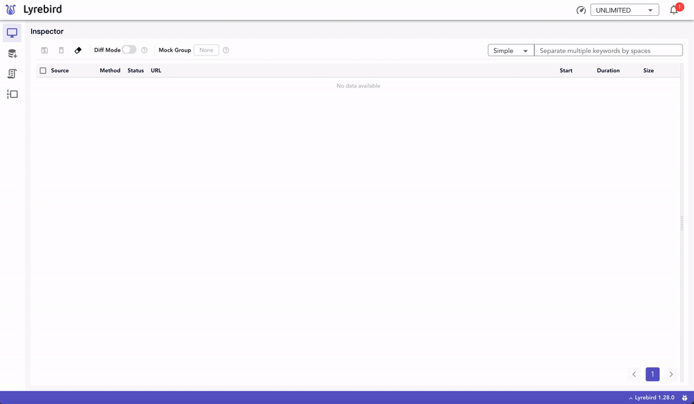
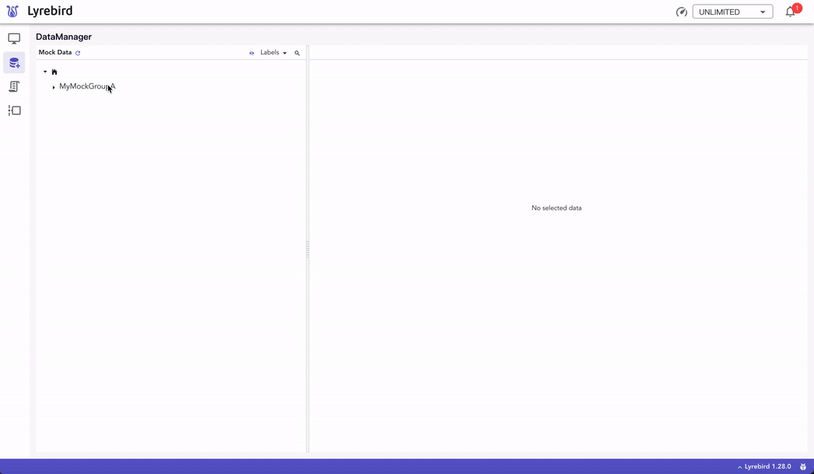
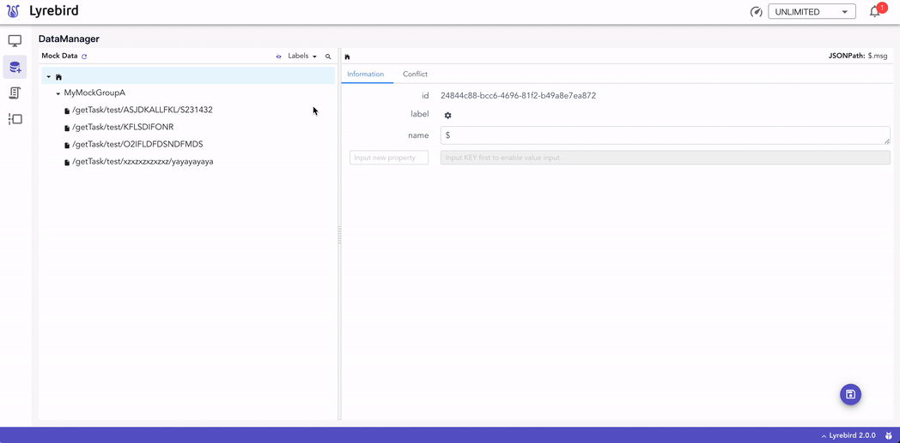

# 快速开始

## 环境要求

- macOS / Linux / Windows

- Python3.7 及以上 或 Docker

## 安装

```shell
pip3 install lyrebird
```

### 安装插件 (选装)

```shell
# Android插件
pip3 install lyrebird-android
# iOS插件
pip3 install lyrebird-ios
# 埋点检查插件
pip3 install lyrebird-tracking
# API覆盖率插件
pip3 install lyrebird-api-coverage
```

## 启动

```shell
lyrebird
```

## 连接移动设备

- 启动 Lyrebird 后，移动设备需要通过代理的方式将请求数据接入。

- 将移动设备的代理地址设为当前电脑地址，默认端口为 4272（IP 地址可查看 Lyrebird 启动时输出的日志）

- 被测设备上用浏览器打开 http://mitm.it, 选择对应操作系统安装证书

  - 信任刚才安装的证书。

  - 现在，可以开始操作移动设备了。Lyrebird 将显示捕获到的 http 请求。

## 查看及录制数据



- 在 Inspector 上激活一个数据组(数据组需要在 DataManager 创建)。

- 选中 Inspector 上的请求后，按保存按钮即可将数据保存到已激活的数据组中。

## 使用 mock 数据



- 在 DataManager 中可编辑已保存的 Mock 数据。

- 在 Inspector 或 DataManager 中激活数据后，同样的请求会得到 mock 数据。

## 管理 mock 数据



- 在 DataManager 上完全的管理 Mock 数据：激活、剪切、复制、删除等
