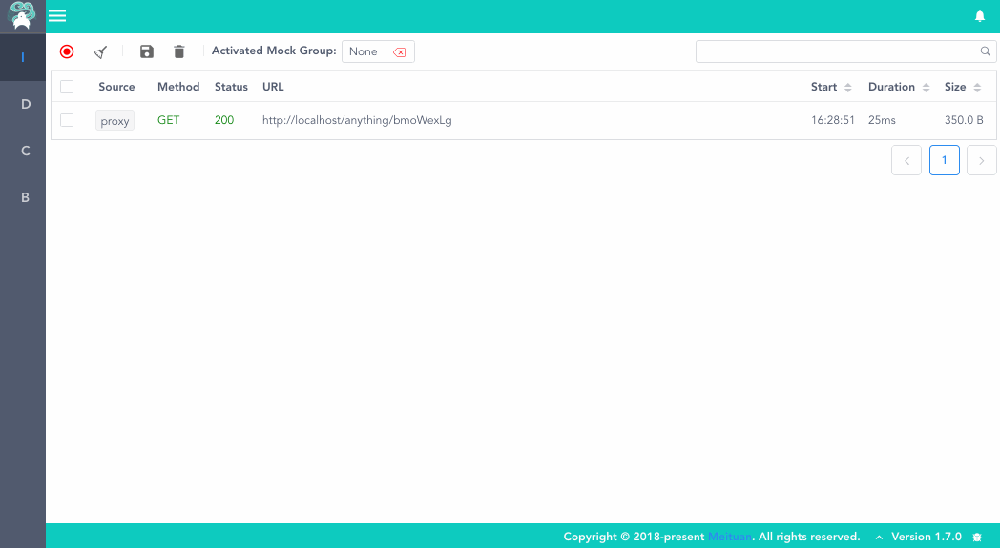

# 快速开始

## 环境要求

* macOS OR Linux

* Python3.6及以上

## 安装

```shell
pip3 install lyrebird
```

### 安装插件 (选装)

```shell
# Android插件 
pip3 install lyrebird-android
# iOS插件
pip3 install lyrebird-ios
# 埋点检查插件
pip3 install lyrebird-tracking
# API覆盖率插件
pip3 install lyrebird-api-coverage
```
        
## 启动

```shell
lyrebird
```

## 连接移动设备

* 启动Lyrebird后，移动设备需要通过代理的方式将请求数据接入。                

* 将移动设备的代理地址设为当前电脑地址，默认端口为4272（IP地址可查看Lyrebird启动时输出的日志）

* 被测设备上用浏览器打开 http://mitm.it, 选择对应操作系统安装证书

    * 信任刚才安装的证书。

    * 现在，可以开始操作移动设备了。Lyrebird将显示捕获到的http请求。

## 查看及录制数据



* 在Inspector上激活一个数据组(数据组需要在DataManager创建)。

* 选中Inspector上的请求后，按保存按钮即可将数据保存到已激活的数据组中。


## 使用mock数据


* 在DataManager中可编辑已保存的Mock数据。

* 在Inspector或DataManager中激活数据后，同样的请求会得到mock数据。

## 管理mock数据


* 在DataManager上完全的管理Mock数据：激活、剪切、复制、删除等
