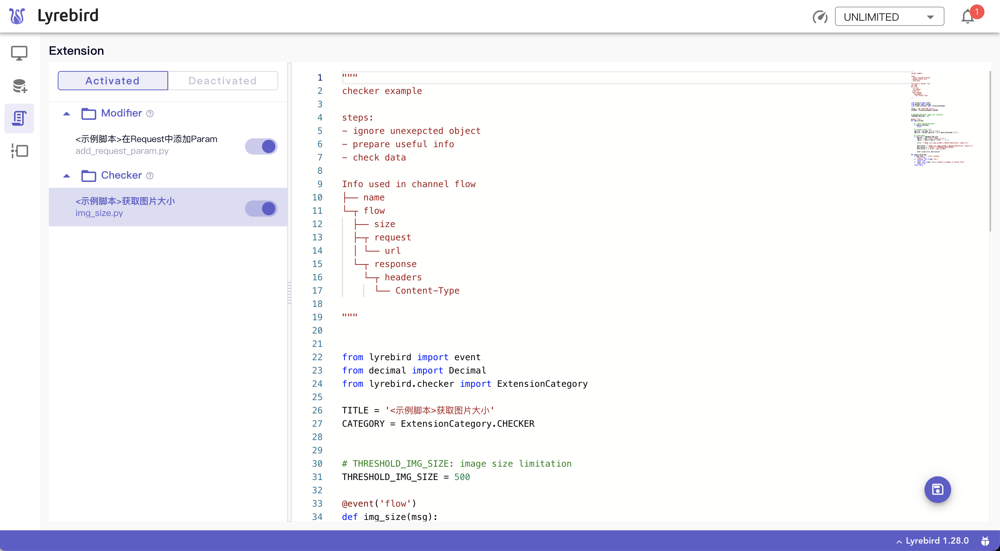
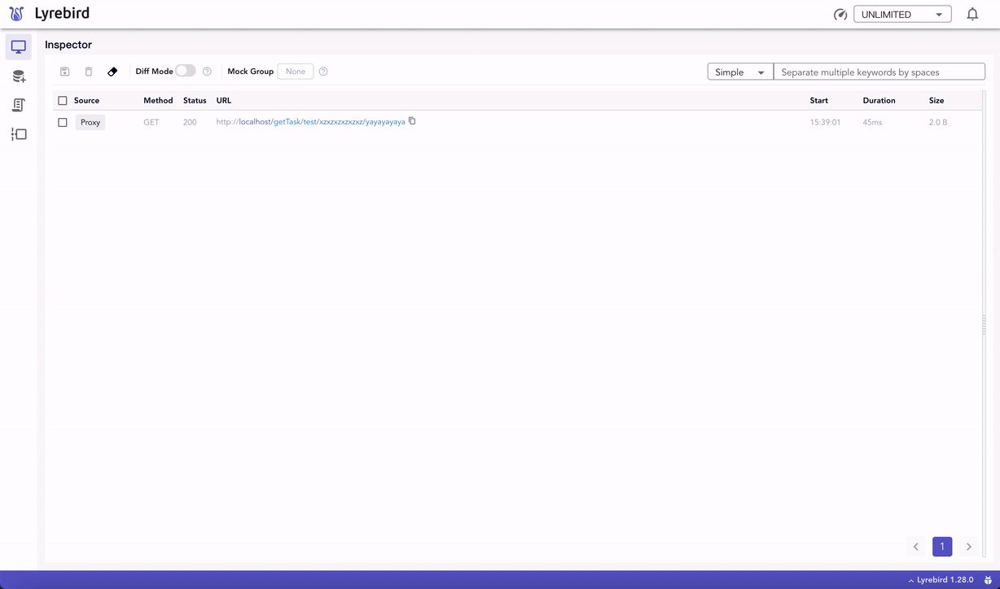

# 检查器
检查器(Checker)是一种支持用户⾃定义的python脚本，在Lyrebird运行的过程中，于Lyrebird后台并行的工作。展开Checker标签可查看当前运行的检查器。

检查器中可以监听Lyrebird中的所有网络请求，也可监听消息总线中的其他事件，对其中需要校验的目标数据进行检测。

## 载入检查器

运行时携带的检查器存放在默认路径~/.lyrebird/checkers下，用户可新增、删除、修改目录下的检查器。

更多载入检查器的方式见[检查器](/checkers/)。

## 示例脚本

运行时，当默认目录中没有可用的检查器时，会自动载入示例脚本。目前提供的示例脚本如下：

| Filename | Description |
| :------- | :---------- |
| duplicate_requests.py | 检查在某段时间内是否有重复的网络请求 |
| img_size.py | 检查图片大小是否超出限制 |

检查器编写方式见[检查器](/checkers/)。

## 捕获报警

在获取到数据后，便可对该数据进行检验和处理。在检测到目标数据超过阈值时，可在通知中心中查看报警。

