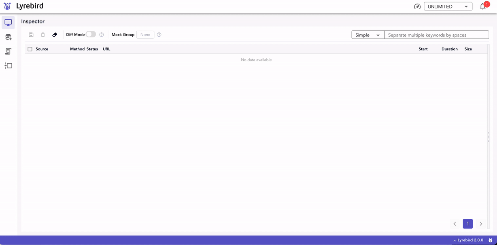
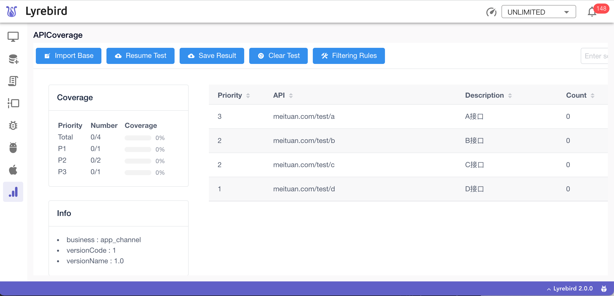

# 扩展
## 自定义脚本
自定义脚本是一种支持用户⾃定义的Python脚本，在Lyrebird运行的过程中，于Lyrebird后台并行地工作。展开Extension标签可查看当前运行的自定义脚本。


自定义脚本中可以监听Lyrebird中的所有网络请求，也可监听消息总线中的其他事件，对其中需要校验的目标数据进行检测。

### 载入自定义脚本

运行时携带的自定义脚本存放在默认路径~/.lyrebird/checkers下，用户可新增、删除、修改该目录下的自定义脚本。

更多载入检查器的方式见[载入自定义脚本](/checker/#载入自定义脚本)。

### 示例脚本

运行时，当默认目录中没有可用的自定义脚本时，会自动载入示例脚本。目前提供的示例脚本如下：

| Filename | Type | Description |
| :------- | :------- | :------- |
| [img_size.py](https://github.com/Meituan-Dianping/lyrebird/tree/master/lyrebird/examples/checkers/img_size.py) | 检查器 | 检查网络请求中图片大小是否超出限制 |
| [duplicate_requests.py](https://github.com/Meituan-Dianping/lyrebird/tree/master/lyrebird/examples/checkers/duplicate_requests.py) | 检查器| 检查在某段时间内是否有重复的网络请求 |
| [add_request_param.py](https://github.com/Meituan-Dianping/lyrebird/tree/master/lyrebird/examples/checkers/add_request_param.py) | 修改器 | 在Request中添加Param |
| [add_response_header.py](https://github.com/Meituan-Dianping/lyrebird/tree/master/lyrebird/examples/checkers/add_response_header.py) | 修改器 | 在Response中添加Header Key |

检查器编写方式见[第一个检查器](/checker/dev_debug.html)。

### 捕获报警

在获取到数据后，便可对该数据进行检验和处理。在检测到目标数据超过阈值时，可在通知中心中查看报警。




## 自定义插件

相比[自定义脚本](./checker.html)，自定义插件(Plugin)是一种自定义程度更高的扩展方式。不仅可以监听Lyrebird[事件](../advance/eventbus.html)，还可以自定义UI和接口。通过自定义插件可以完成复杂的功能扩展,对Lyrebird能力进行扩展或者实现定制化的功能。


### Android插件

支持Android设备的插件。为Lyrebird提供设备信息、日志、截图、命令执行、崩溃监控、APP信息及拉起应用功能。


##### 安装

```
pip3 install lyrebird-android
```
##### [使用说明](../plugins/android.html)
##### [代码仓库](https://github.com/Meituan-Dianping/lyrebird-android)


### iOS插件

支持iOS设备的插件。为Lyrebird提供设备信息、APP信息、截图和拉起APP功能。


##### 安装

```
pip3 install lyrebird-ios
```
##### [使用说明](../plugins/ios.html)
##### [代码仓库](https://github.com/Meituan-Dianping/lyrebird-ios)


##### 安装

```
pip3 install lyrebird-tracking
```
##### [使用说明](../plugins/tracking.html)
##### [代码仓库](https://github.com/Meituan-Dianping/lyrebird-tracking)


### API覆盖率插件(APICoverage)

通过对API统计实现测试覆盖度量的扩展工具。



##### 安装

```
pip3 install lyrebird-api-coverage
```
##### [使用说明](../plugins/api-coverage.html)
##### [代码仓库](https://github.com/Meituan-Dianping/lyrebird-api-coverage)

### BugIt插件

将实时收集的设备信息、APP信息、请求记录、日志等作为描述或附件一键提交到BUG管理系统的工具。
除手动跳转到BugIt界面进行操作外也可通过[自定义脚本](./checker.html)触发的[通知](./checker.html#捕获报警)跳转到BugIt。


##### 安装

```
pip3 install lyrebird-bugit
```
##### [使用说明](../plugins/bugit.html)
##### [代码仓库](https://github.com/Meituan-Dianping/lyrebird-bugit)