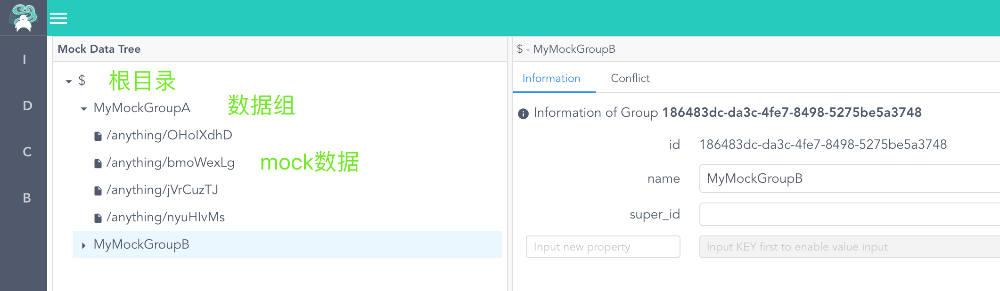
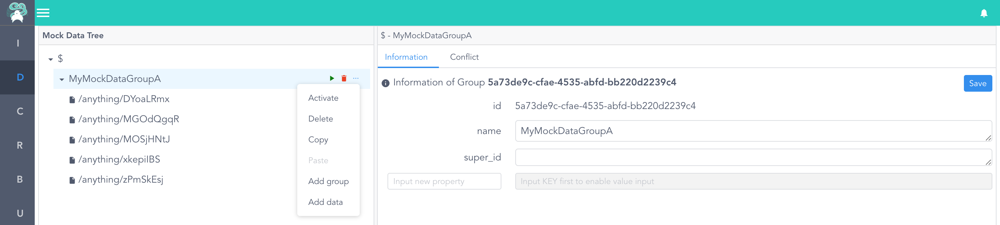
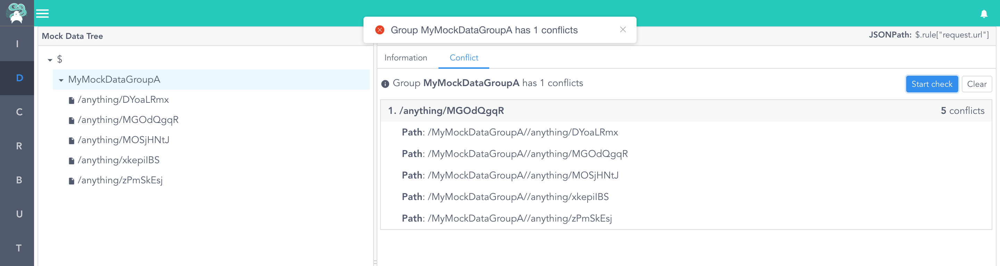
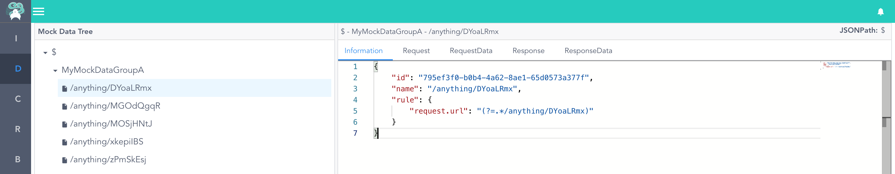
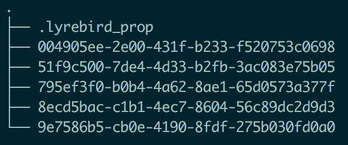
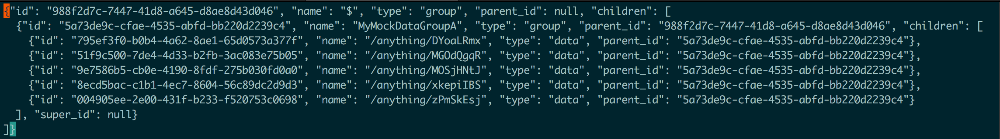

# Mock数据管理

## 概念



**数据**

保存Mock数据时每个请求和响应保存为一条数据(mock data)。

**数据组**

一个目录下可以保存多条mock数据，或多个数据目录。我们把这种目录称作数据组(Group)

**Mock数据仓库**

一个包含若干数据组或Mock数据的文件夹。

Lyrebird以此处作为跟目录加载所有的Mock数据。

每个数据仓库会默认生成一个根，名称为$。

## 存储

- mock数据默认存储于 ~/.lyrebird/mock_data/personal 目录下。此目录即mock数据仓库。

- 也可以在Lyrebird启动时通过 --data 重新指定一个mock数据仓库。

    ```bash
    lyrebird --data /your/data/dir
    ```

- 在启动过一次Lyrebird之后也可以通过修改 ~/.lyrebird/conf.json 来配置mock数据仓库的默认路径。

    ```json
    {
        "version": "0.10.5",
        "proxy.filters": [],
        "proxy.port": 4272,
        "mock.port": 9090,
        "mock.data": "{{current_dir}}/mock_data/personal"
    }
    ```
    
    通过修改mock.data来重新定义mock数据仓库


## 操作

### 数据组


#### 快捷操作

-  ：激活

-  ：删除

#### 上下文菜单

- 激活（Activate）

- 删除 (Delete)

- 复制 (Copy)

- 粘贴 (Paste)

- 新建数据组 (Add group)

- 新建mock数据 (Add data)

#### 数据组属性

在左侧树形浏览窗选中数据组后，右侧详情页就会展示出数据组的属性。

- ID 数据组的唯一标识

- name 数据组的名称，可修改

- super_id 继承数据组ID

#### 冲突检查



选中数据组时，可以进行mock数据命中规则冲突检查。

该检查会显示命中规则相同或者互相包含的数据。

请注意处理检查结果，以免命中了错误的mock数据。


## 命中规则



选中mock数据时，右侧详情页会显示数据详情。

Infomation页面中 rule字段是该条数据的命中规则。

在该数据被激活后，每个经过Lyrebird的请求，都会和这个规则进行匹配判断，如果匹配此规则，该数据就会被Lyrebird作为响应发回到客户端。

### request.url

该规则是一个用于匹配URL字符串的正则表达式。

**例子**

```json
{
    "rule": {
        "request.url": "(?=.*/anything/DYoaLRmx)(?=.*argA=1)"
    }
}
```
该规则会匹配任何包含 "/anything/DYoaLRmx" 和 "argA=1" 的URL


## 在自动化测试中使用mock功能

- 在自动化测试中，可以通过API控制Lyrebird激活数据。
实现每个测试使用不同的mock数据。

- mock数据可存在于独立的git仓库中，也可以和测试代码存储在一个仓库。

- 启动Lyrebird时，指定mock数据所在目录后即可开始使用。

    ```bash
    lyrebird --data /your/mock/data/dir
    ```

- API详见[接口](./api.html)


## 通过Git管理mock数据



**Mock数据目录结构如上图所示**

- .lyrebird_prop 是数据关系文件
- 其他是数据文件




**.lyrebird_prop 文件结构如上图所示**

- 每个数据或数据组独占一行
- 有冲突时可以很直观的通过git diff处理
