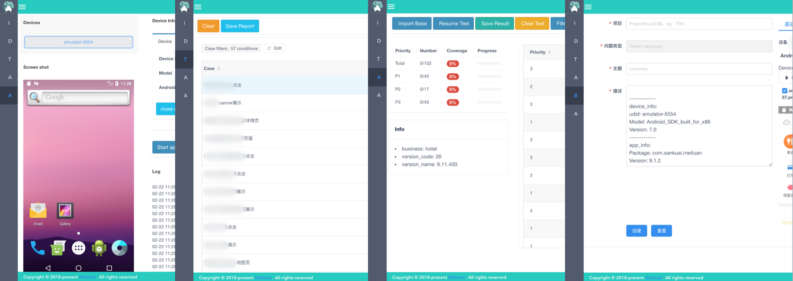
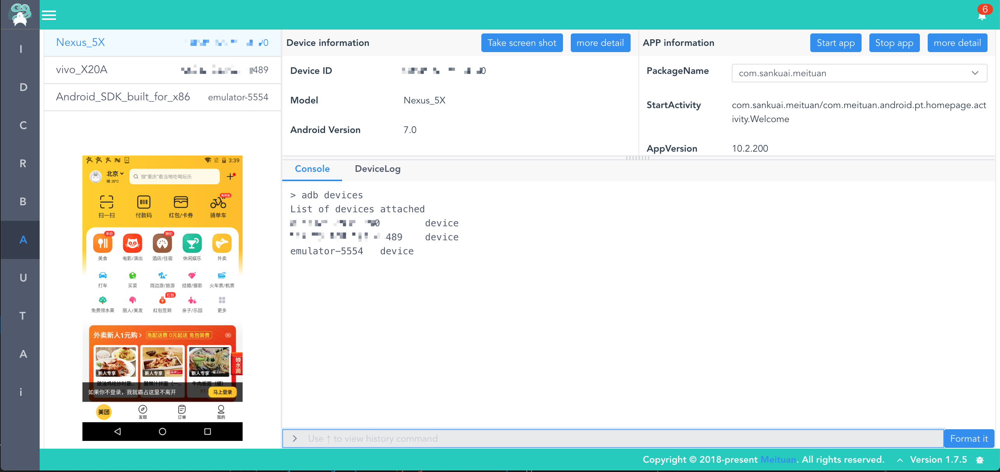
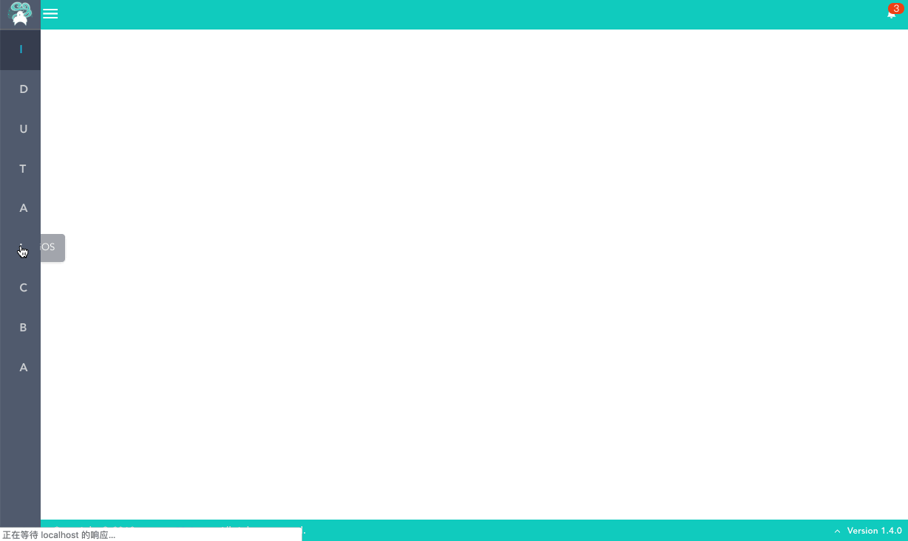
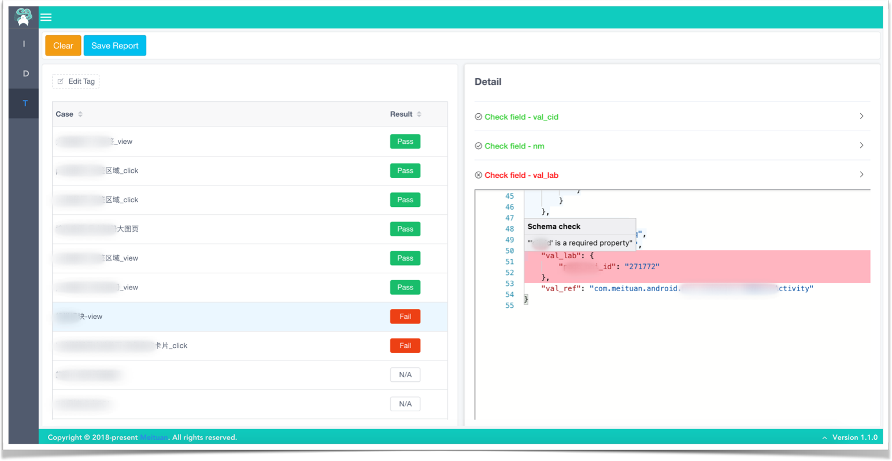
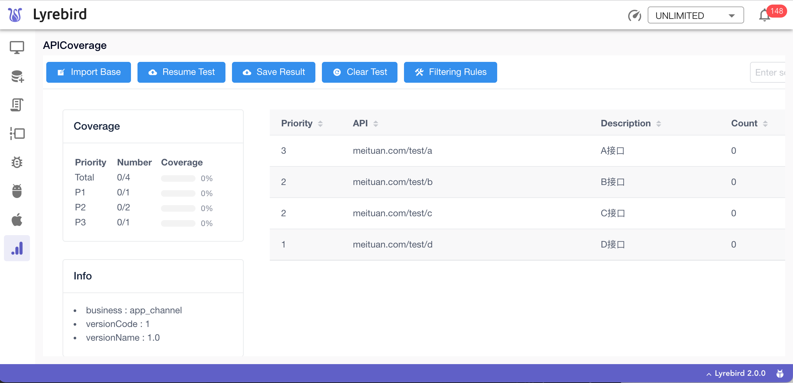

# 插件

相比[检查器](./checker.html)([Checker](./checker.html))，插件(Plugin)是一种自定义程度更高的扩展方式。不仅可以监听Lyrebird[事件](../advance/eventbus.html)，还可以自定义UI和接口。通过插件可以完成复杂的功能扩展,对Lyrebird能力进行扩展或者实现定制化的功能。



## Android插件

支持Android设备的插件。为Lyrebird提供设备信息、日志、截图、命令执行、崩溃监控、APP信息及拉起应用功能。



#### 安装

```
pip3 install lyrebird-android
```
#### [使用说明](../plugins/android.html)
#### [代码仓库](https://github.com/Meituan-Dianping/lyrebird-android)


## iOS插件

支持iOS设备的插件。为Lyrebird提供设备信息、APP信息、截图和拉起APP功能。



#### 安装

```
pip3 install lyrebird-ios
```
#### [使用说明](../plugins/ios.html)
#### [代码仓库](https://github.com/Meituan-Dianping/lyrebird-ios)


## 埋点插件(Tracking) 

针对埋点请求验证实现的扩展。可以自动验证埋点上报数据、辅助高亮埋点上报数据、生成埋点测试报告并导出到html文件。



#### 安装

```
pip3 install lyrebird-tracking
```
#### [使用说明](../plugins/tracking.html)
#### [代码仓库](https://github.com/Meituan-Dianping/lyrebird-tracking)


## API覆盖率插件(APICoverage)

通过对API统计实现测试覆盖度量的扩展工具。



#### 安装

```
pip3 install lyrebird-api-coverage
```
#### [使用说明](../plugins/api-coverage.html)
#### [代码仓库](https://github.com/Meituan-Dianping/lyrebird-api-coverage)

## Issue生成插件(BugIt)

将实时收集的设备信息、APP信息、请求记录、日志等作为描述或附件一键提交到BUG管理系统的工具。
除手动跳转到BugIt界面进行操作外也可通过[检查器](./checker.html)([Checker](./checker.html))触发的[通知](./checker.html#捕获报警)跳转到BugIt。


#### 安装

```
pip3 install lyrebird-bugit
```
#### [使用说明](../plugins/bugit.html)
#### [代码仓库](https://github.com/Meituan-Dianping/lyrebird-bugit)