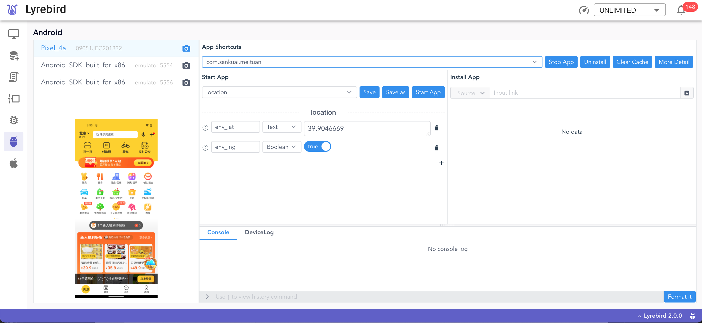
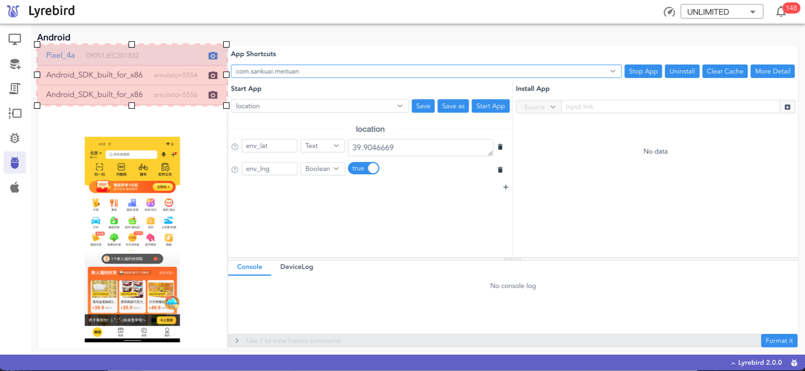

# Android插件

支持Android设备的[插件](../plugins/)。为Lyrebird提供设备信息、日志、截图、命令执行、崩溃监控、APP信息及拉起应用功能。



## 快速开始

### 环境要求

* macOS

* Python3.6及以上

* 安装[AndroidSDK](https://developer.android.com/studio/)，并设置SDK环境变量 “ANDROID_HOME”

* Lyrebird 1.7.0及以上

### 安装

```bash
pip3 install lyrebird-android
```

### 启动

```bash
lyrebird
```

## 功能介绍

使用USB线连接手机和电脑，打开设备的调试模式，设备会出现在左侧的设备列表中。

列表展示设备的model和序列号，高亮当前选中的设备。



列表下方展示当前选中设备的屏幕快照。


:::tip
屏幕快照存储于```~/.lyrebird/plugins/lyrebird_android/screenshot/```目录中，会在lyrebird启动时清空并删除上述目录
:::

### 控制应用

应用信息区中可以查看设备中所有的package，可对package进行如下操作：
- Start
- Stop
- Install
- Uninstall
- Clear Cache


#### 拉起应用
支持在拉起应用时传入参数，该参数将以--es的方式传入App。

#### 安装应用
通过安装链接安装应用。

#### 指定默认读取应用

可指定启动后默认读取的应用。默认读取的应用存储于Lyrebird统一管理的配置文件中，通过设置或修改"plugin.android"的"package"值来更改默认应用。

```json
{
    ...
    "plugin.android": {
        "package": "com.sankuai.meituan"
    },
    ...
}
```

Lyrebird统一管理的配置文件，默认存放在~/.lyrebird/conf.json文件中。


应用信息区提供启动应用和关闭应用的功能。

在支持搜索的package下拉列表中选择目标应用，可对该应用执行启动操作和关闭操作。


### 获取系统日志

设备日志展示于下方的DeviceLog中。


::: tip
设备日志文件存储在```~/.lyrebird/plugins/lyrebird_android/tmp/```目录中，前端展示最新的200行日志。
:::

### 命令行工具

通过下方的Console，可以执行命令来获取信息和操纵设备。


控制台可以记录历史操作记录，通过键盘的⬆键和⬇键翻动查看。

此外，提供格式化展示命令的窗口，可以将命令切分展示，使之更便于阅读。


Android插件的更多内容，详见[代码仓库](https://github.com/Meituan-Dianping/lyrebird-android)
