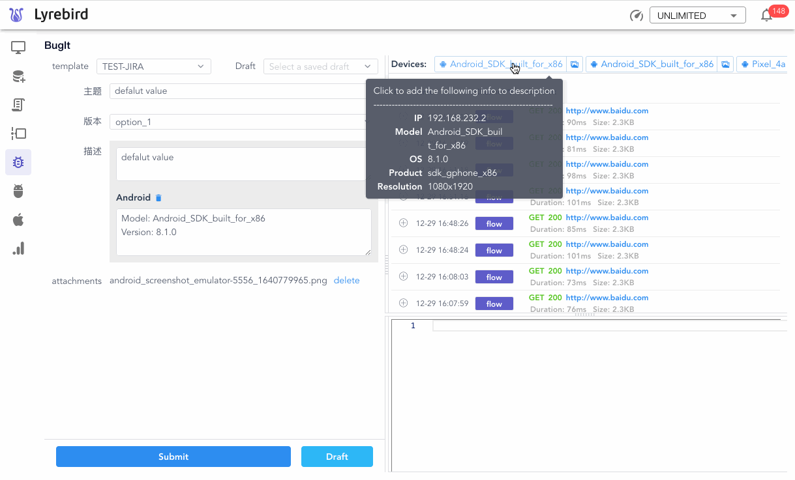
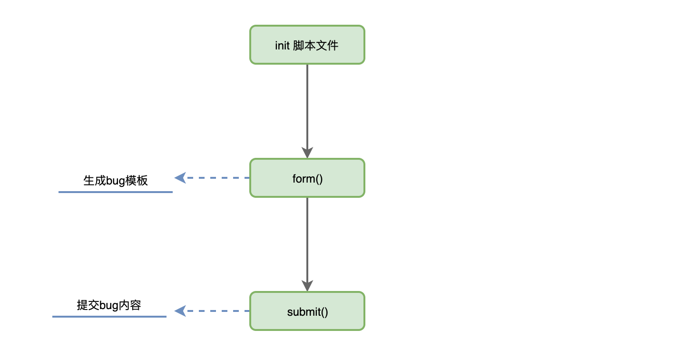
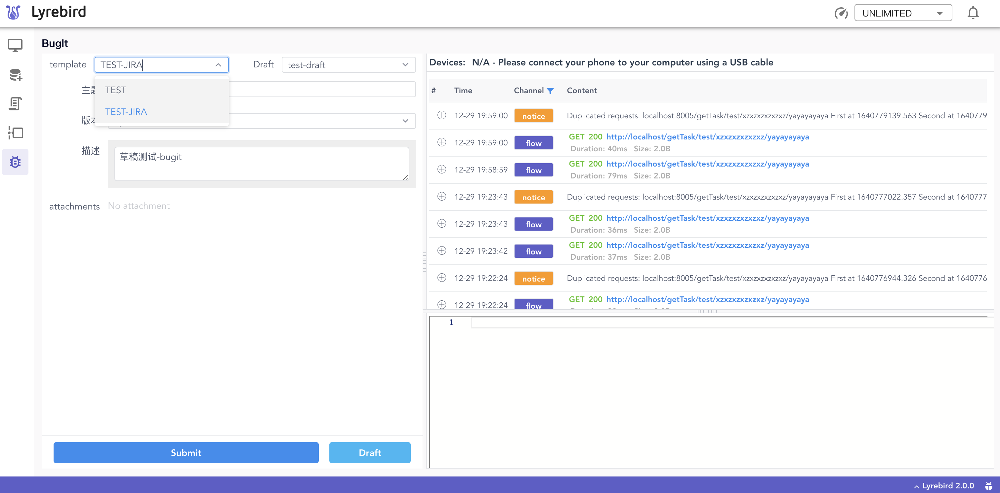
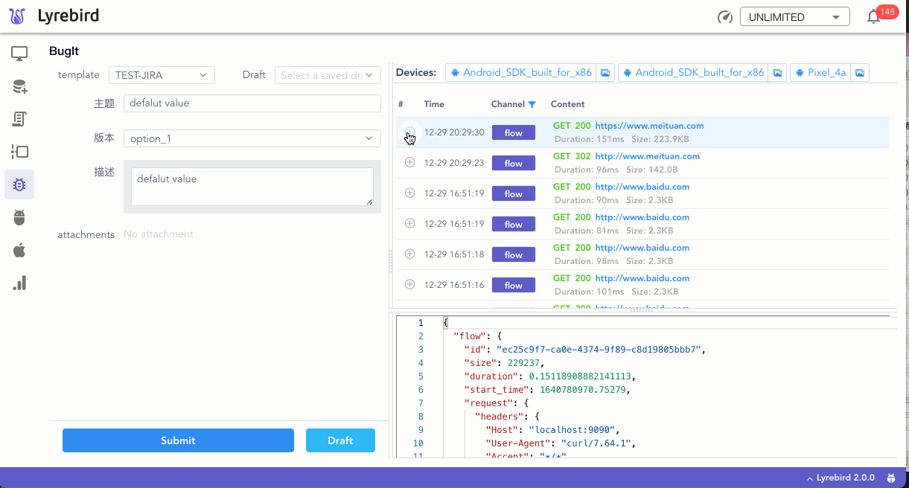

# Issue生成插件

BugIt 是一个Issue生成的插件，目前应用于提交Bug场景下。

配合其他插件，BugIt提供了一种准确、快捷、有效的Issue生成服务。除填写Issue配置字段外，BugIt还提供Lyrebird中[检查器](../checker/)([Checker](../checker/))与其他[插件](../plugins/)([Android](./android.md)、[iOS](./ios.md))数据。

通过脚本配置，可支持任意Bug管理系统。

## 快速开始
### 环境要求

- macOS OR Linux

- Python3.6及以上

- Lyrebird 1.6及以上

### 安装

```sh        
pip3 install lyrebird-bugit
```
### 载入脚本文件

BugIt workplace 配置由[Lyrebird配置文件](../guide/config.html)统一管理。

通过修改 ~/.lyrebird/conf.json 中 "bugit.workspace" 的值，可以修改 BugIt 读取脚本文件的路径。

对脚本的新增、修改、删除，可以在该目录下操作文件。

::: tip
使用BugIt时，必须有一个及以上的脚本文件
:::

配置脚本请参考[示例脚本](#示例脚本)。

## 功能介绍
### Bug提交

读取脚本文件后，BugIt会得到一个Bug信息填充的界面，称之为Bug表单。

用户可以自定义Bug字段的 名称、先后顺序、填写样式、默认值。


BugIt可以通过配置服务向任意Bug管理系统提交Issue

### API数据获取

BugIt支持自动填充Lyrebird运行过程中抓取到的数据信息。


### 报警获取

在[检查器](../checker/)([Checker](../checker/))捕获报警后，可以通过通知中心随时跳转至BugIt。

在右侧数据面板中，可以对历史[消息总线](/advance/eventbus.md)中的信息进行回溯，补充至Bug中。


### 缓存功能

按下[Commond]+[s]键，会将Bug相关字段信息进行存储。

缓存信息不受Lyrebird服务开关、浏览器缓存、脚本/界面切换的影响。


有效的利用缓存功能，是提高Bug上报效率的关键。

### 插件在Bugit中的应用

#### Android iOS插件

安装[Android插件](./android.md)、[iOS插件](./ios.md)后，BugIt支持设备信息扩展服务。

- 设备信息获取
   - BugIt 支持将设备名称、设备系统版本、被测 App 信息（Bundle ID(iOS)/PackageName(Android)）填充到Issue内容中。
- 实时设备截图
   - BugIt 可以实时获取设备截图，并支持在截图上进行涂鸦、文本标记。
   - 提交 Bug 时，截图将作为附件一并提交给脚本配置服务。
- Crash Log 获取
   - 在Lyrebird运行过程中，如发生 被测 App 发生 Crash，BugIt 会捕获到 Crash Log。
   - 提交 Bug 时，Crash Log 将作为附件一并提交给脚本配置服务。
   - Crash 获取 暂不支持 iOS 设备



## Bug脚本说明

BugIt通过加载配置脚本提供向Bug管理系统提交Issue的功能

### 脚本示意图


配置脚本需包含以下三部分
- [init配置文件](#init配置文件)
- [form()](#form)
- [submit()](#submit)

### BugIt数据传递

context 用于存储 BugIt 运行过程中产生的数据信息。[form()](#form)、[submit()](#submit)方法依赖于这些数据信息实现Bug信息的展示与提交

context关键字说明
key|说明|使用场景
:--:|:--|:--:
cache|存储Bug缓存信息，详细用法请参考[Bug信息缓存](#bug信息缓存)|form()
issue|存储Bug表单信息|issue()
key|存储最近一次提交成功的Issue key|issue()、attachments()
attachments|存储需要上报的附件信息|attachments()

### init配置文件

BugIt 通过 name 来标识配置文件。

::: tip
BugIt 脚本必须含有 'name' 属性
:::

```python
"""
Template name
"""        
name = 'TEST-JIRA'
```
name 用于在 BugIt 前端页面上展示脚本名称。



选中配置文件后，BugIt init 脚本文件，获取脚本文件中回调方法([form()](#form)、[submit()](#submit))。

### form()

form() 方法用于自定义Bug表单的字段与填写样式。

Bug 中的每一字段由一dict定义（通常称之为FormItem），表单配置时，通过dict的以下关键字去控制字段的名称、默认值、样式等内容。

::: tip
form()方法应返回一由FormItem组成的list。
:::

#### FormItem dict说明
key|说明|枚举值|是否必填
:--:|:--|:--:|:--:
name|展示在页面上的字段名称|--|Y
value|对应字段填充的值|--|N
component|字段展示的组件形式|'input'、'select'、'compoundTextarea'|Y
options|配合 select component使用，用于存放select component的选项内容|--|N

#### BugIt 支持的 component
- input
```python
form_item_input = {
    'name': '主题',
    'component': 'input',
    'value': 'defalut value'
}
```


input 组件会生成一个文本输入框，在声明时如果 value 不为空，则会作为默认值填充在输入框中

- select

```python
form_item_select = {
    'name': '版本',
    'component': 'select',
    'options':[
        {'id':'001','name':'option_1'},
        {'id':'002','name':'option_2'}
    ],
    'value': '001'
}
```


select组件会生成一个筛选框，筛选项由 options 定义，options 为一个 list，其中每一元素为 dict 类型。

option dict说明
key|说明|是否必填
:--:|:--|:--:
id|筛选项唯一标识|Y
name|筛选项在前端展示文本内容|Y

::: tip
select 组件中，value应为option dict中对应 id 的值
:::
- compoundTextarea

compoundTextarea组件会生成一个文本框，在声明时如果 value 不为空，则会作为默认值填充在文本框中

```python
form_item_text = {
    'name': '描述',
    'component': 'compoundTextarea',
    'value': 'defalut value'
}
```


compoundTextarea组件在 BugIt 中还用于支持 Lyrebird 其他信息的扩展。

选择[消息总线](/advance/eventbus.md)或[其他插件](#插件在bugit中的应用)的数据时，该数据将作为附加信息展示在 compoundTextarea 中。



对应的数据信息将作为 'extraMsg' 存放在 FormItem中。
此时From Item变成

```python
form_item_text = {
    'name': '描述',
    'component': 'compoundTextarea',
    'value': 'defalut value',
    'extraMsg':[
        {'message':'Flow Info'},
        {'message':'Notice Info'},
        {'message':'Devices Info'}
    ]
}
```

#### form()方法示例代码

```python
def form(context):
    """
    BugIt callback function

    BugIt will call this function when user select this template from UI.
    This function should return a array, list all FormItem dict.

    """
    form_item_input = {
        'name': '主题',
        'component': 'input',
        'value': 'defalut value'
    }
    form_item_select = {
        'name': '版本',
        'component': 'select',
        'options':[
            {'id':'001','name':'option_1'},
            {'id':'002','name':'option_2'}
        ],
        'value': '001'
    }
    form_item_text = {
        'name': '描述',
        'component': 'compoundTextarea',
        'value': 'defalut value'
    }
    form = [form_item_input,form_item_select,form_item_text]
    return form
```
示例代码生成的 Bug 表单如下图所示


::: tip
form()方法入参 [context](#bugit数据传递) ，可用于传递缓存数据，相关用法详见[Bug信息缓存](#bug信息缓存)
:::
### submit()

submit()方法用于向bug系统上提交Issue，生成Bug。

::: tip
submit()方法返回一组用于处理 submit 行为的方法。
:::

方法说明
方法名|入参|说明
:--:|:--:|:--
issue|context|处理 Bug表单中的信息，通过 API 向 Bug 管理系统提交 Issue
attachments|context|处理附件信息（如 [Android插件](./android.md)、[iOS插件](./ios.md)提供的截图或 Log），通过 API 向 创建的 Issue 中添加附件
#### submit()方法示例代码（以JIRA服务为例）

```python
def submit():
    """
    BugIt callback function

    BugIt will call this function when user tap submit button.
    This function should return a array, contains all submit actions.

    Each submit-action function have a argument. It contains form data and attachments info.
    """
    return [issue, attachments]

def issue(context):
    """
    This function is used to submit Issue 
    """
    form_data = context['issue']
    jira_fields = {}

    # transform from_data to payload submited to API of JIRA
    for form_item in form_data:
        if form_item['name'] == '主题' :
            jira_fields['summary'] = form_item['value']
        elif form_item['name'] == '版本':
            jira_fields['version'] = {
                id:form_item['value']
                }
        elif form_item['name'] == '描述':
            jira_fields['description'] = form_item['value']
            # add extraMsg to description 
            if form_item['extraMsg']:
                for add_des in form_item['extraMsg']:
                    jira_fields['description'] +='\n'
                    jira_fields['description'] +='------------------------------\n'
                    jira_fields['description'] +=add_des['message']

    url = 'http://www.example.com/jira/rest/api/2/issue'
    header = {
        'Content-Type': 'application/json;charset=utf-8'
    }
    resp = requests.post(url, auth=('YOUR JIRA_USER_NAME', 'YOUR_JIRA_PASSWD'),json={"fields": jira_fields},headers=header)
    
    if resp.status_code >= 200 and resp.status_code < 300:
        body = json.loads(response.text)
        if body.get('key') :
            context['key'] = body['key']
        else:
            raise Exception(f'Submit failed {response.text}')
    else:
        raise Exception(f'Create issue failed with code {response.status_code}\n{response.text}')


def attachments(context):
    """
    This function is used to upload attachments to the Issue which has been created
    """
    key = context['key']
    attachments = context['attachments']

    if len(attachments) == 0:
        # No attachments
        return

    url = f'http://www.example.com/jira/rest/api/2/issue/{key}/attachments'
    headers = {
        'X-Atlassian-Token': 'nocheck'
    }
    multiple_files = []

    # transform attachment data to payload submited to API of JIRA
    for attachment in attachments:
        attachment_path = Path(attachment['path'])
        multiple_files.append(
            ('file', (attachment_path.name, open(str(attachment_path), 'rb')))
        )
    response = requests.post(url, files=multiple_files, headers=headers)

    if response.status_code == 200 and response.json()['code'] == 0:
        print('Submit attachments success')
    else:
        raise Exception(f'Submit failed {response.text}')
```

## 脚本高级
### Bug表单动态化配置
在提交Bug场景中，Bug表单的配置可能会由于项目结构的调整而发生变化。配置脚本的频繁变更会带来额外的工作量及不稳定因素。

针对此问题，可以采用动态化配置Bug表单的方法使 BugIt 更加灵活。

以以[JIRA](https://www.atlassian.com/software/jira/)服务为例，我们可以通过 API 实时地获取到 Bug 表单所需要的字段及格式。在 form() 方法中对API返回表单数据进行组装，返回符合 form() 预期结果的 list
#### 示例代码
```python

PROJECT_KEY = 'TEST'
ISSUE_TYPE_ID = '10'

def get_fields_metadata_from_JIRA_API():
    """
    Get origin fields by JIRA Rest API
    projecKeys: Set your project key
    issueTypeId: Set your issue type id
    expand: projects.issuetypes.fields
    """
    response = requests.get(
        f'http://http://www.example.com/jira/rest/api/2/issue/createmeta?projectKeys={PROJECT_KEY}&issuetypeIds={ISSUE_TYPE_ID}&expand=projects.issuetypes.fields')
    result = response.json()
    fields = result['projects'][0]['issuetypes'][0]['fields']
    return fields

def make_options(field):
    """
    Make options of FormItem when field is select component
    """
    for option in field['allowedValues']:
        if 'name' not in option:
            option['name'] = option['value']
    return field['allowedValues']

def make_item(key, field, value=None, component=None):
    """
    Make origin field from JIRA to FieldItem
    key: JIRA field key
    name: Displayed as the FormItem name
    schema: JIRA field schema
    """
    schema = field['schema']
    item = dict(key=key, name=field['name'], required=field['required'], schema=schema)
    if value:
        item['value'] = value
    if 'allowedValues' in field:
        item['component'] = 'select'
        item['options'] = make_options(field)
    else:
        item['component'] = 'input'
    if component:
        item['component'] = component
    return item

def form(context):
    jira_fields = get_fields_metadata_from_JIRA_API()
    custom_fields = OrderedDict({
        '描述': {
            'component': 'compoundTextarea'
        }
    })
    required_fields = []
    for field_key in origin_fields:
        field = origin_fields[field_key]
        if field['name'] in custom_fields:
            custom_fields[field['name']].update(make_item(
                field_key,
                field,
                component=custom_fields[field['name']].get('component')
            ))
        elif field['required']:
            required_fields.append(make_item(field_key, field))
        else:
            pass
    form = [*list(custom_fields.values()), *required_fields]
    return form
```

### Bug信息缓存
在form()方法中，利用[context](#bugit数据传递)可以实现数据缓存功能
#### 示例代码
```python
def form(context):
    form = []
    
    # Your code to make form

    """
    get cache if it exsit
    field value will be filled with cache value
    """
    if context.get('cache'):
        for field in form:
            for cache_field in context.get('cache'):
                if cache_field['key'] == field['key']:
                    field['value'] = cache_field.get('value','')
    return form
``` 
## 示例脚本

此示例脚本以[JIRA](https://www.atlassian.com/software/jira/)服务为例

```python

"""
Template name
"""
name = 'TEST-JIRA'

def form(context):
    """
    BugIt callback function

    BugIt will call this function when user select this template from UI.
    This function should return a array, list all FormItem dict.

    """
    form_item_input = {
        'name': '主题',
        'component': 'input',
        'value': 'defalut value'
    }
    form_item_select = {
        'name': '版本',
        'component': 'select',
        'options':[
            {'id':'001','name':'option_1'},
            {'id':'002','name':'option_2'}
        ],
        'value': '001'
    }
    form_item_text = {
        'name': '描述',
        'component': 'compoundTextarea',
        'value': 'defalut value'
    }
    form = [form_item_input,form_item_select,form_item_text]

    """
    get cache if it exsit
    field value will be filled with cache value
    """
    if context.get('cache'):
        for field in form:
            for cache_field in context.get('cache'):
                if cache_field['key'] == field['key']:
                    field['value'] = cache_field.get('value','')

    return form


def submit():
    """
    BugIt callback function

    BugIt will call this function when user tap submit button.
    This function should return a array, contains all submit actions.

    Each submit-action function have a argument. It contains form data and attachments info.
    """
    return [issue, attachments]


def issue(context):
    """
    This function is used to submit Issue 
    """
    form_data = context['issue']
    jira_fields = {}

    # transform from_data to payload submited to API of JIRA
    for form_item in form_data:
        if form_item['name'] == '主题' :
            jira_fields['summary'] = form_item['value']
        elif form_item['name'] == '版本':
            jira_fields['version'] = {
                id:form_item['value']
                }
        elif form_item['name'] == '描述':
            jira_fields['description'] = form_item['value']
            if form_item['extraMsg']:
                for add_des in form_item['extraMsg']:
                    jira_fields['description'] +='\n'
                    jira_fields['description'] +='------------------------------\n'
                    jira_fields['description'] +=add_des['message']

    url = 'http://www.example.com/jira/rest/api/2/issue'
    header = {
        'Content-Type': 'application/json;charset=utf-8'
    }
    resp = requests.post(url, auth=('YOUR JIRA_USER_NAME', 'YOUR_JIRA_PASSWD'),json={"fields": jira_fields},headers=header)
    
    if resp.status_code >= 200 and resp.status_code < 300:
        body = json.loads(response.text)
        if body.get('key') :
            context['key'] = body['key']
        else:
            raise Exception(f'Submit failed {response.text}')
    else:
        raise Exception(f'Create issue failed with code {response.status_code}\n{response.text}')


def attachments(context):
    """
    This function is used to upload attachments to the Issue which has been created
    """
    key = context['key']
    attachments = context['attachments']

    if len(attachments) == 0:
        # No attachments
        return

    url = f'http://www.example.com/jira/rest/api/2/issue/{key}/attachments'
    headers = {
        'X-Atlassian-Token': 'nocheck'
    }
    multiple_files = []

    # transform attachment data to payload submited to API of JIRA
    for attachment in attachments:
        attachment_path = Path(attachment['path'])
        multiple_files.append(
            ('file', (attachment_path.name, open(str(attachment_path), 'rb')))
        )
    response = requests.post(url, files=multiple_files, headers=headers)

    if response.status_code == 200 and response.json()['code'] == 0:
        print('Submit attachments success')
    else:
        raise Exception(f'Submit failed {response.text}')
```
### JIRA API Reference
- [JIRA get create issue meta](https://docs.atlassian.com/software/jira/docs/api/REST/7.6.1/#api/2/issue-getCreateIssueMeta)
- [JIRA create issue](https://docs.atlassian.com/software/jira/docs/api/REST/7.6.1/#api/2/issue-createIssue)
- [JIRA add attachment](https://docs.atlassian.com/software/jira/docs/api/REST/7.6.1/#api/2/issue/{issueIdOrKey}/attachments-addAttachment)
